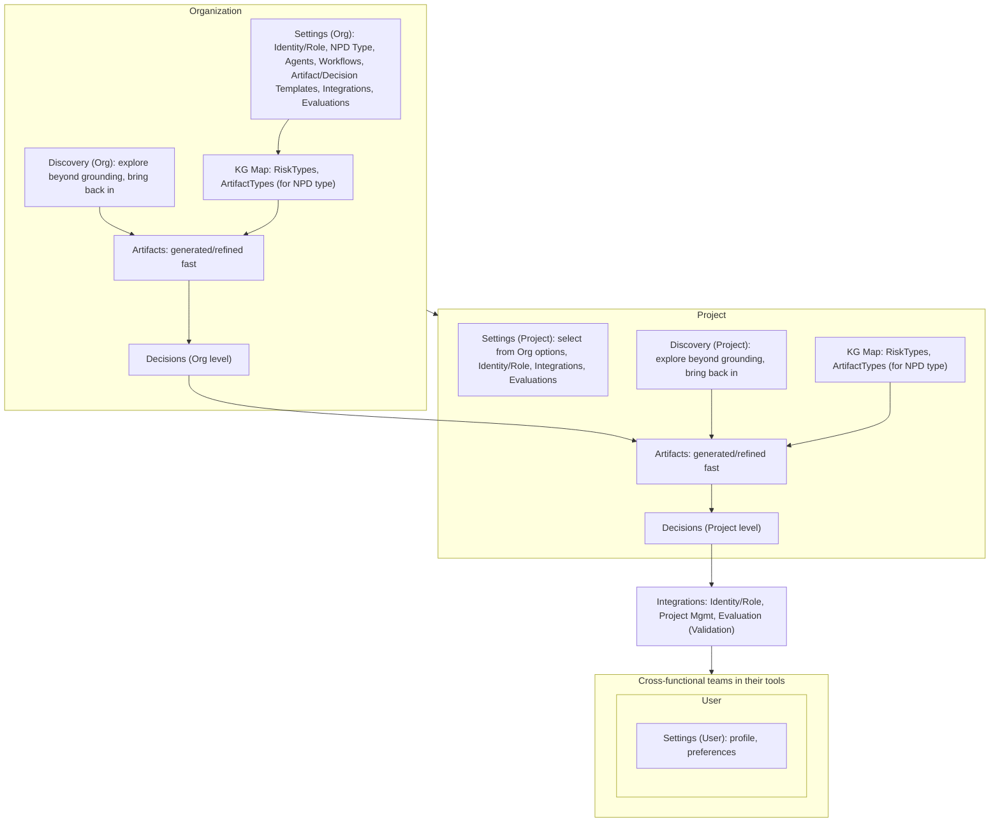

# Product Surface Summary and Review

---

## Summary for non-technical review (founder-friendly)

**What this is:** A one-page view of what the product *surface* is — the main places users go and the main things we configure. We’ve locked in a **small, stable core** and agreed how to grow from here without clutter.

**The product in one story:** At **Organization** level, **Discovery** and the **KG Map** feed **Artifacts**, which enable **Decisions**. Those org **Decisions** feed in alongside **Discovery** and the **KG Map** at **Project** level to enable **Decisions** for the project; that flow leads via **Integrations** to **cross-functional teams** in their current tools (Identity/Role, Project Management to sync projects/issues, Evaluation for Validation), so they don’t have to leave where they already work. **Users** are contained within those teams. **Settings** at **User**, **Organization**, and **Project** levels round out the core - Organization can define available set of NPD Type, Agents, Workflows, Artifact/Decision Templates, Integrations and Project can select the appropriates one.  User gets to fine tune their profile.

**In plain terms:** Work happens inside an **Organization** (the customer) and one or more **Projects** (the NPD initiatives). At **Organization** level, **Discovery** and the **KG Map** (built from the org's **NPD Type** — Digital, IOT, Manufacturing, etc.) feed **Artifacts**, which enable **Decisions** for the organization ; org-level **Settings** (and decisions) flow into the **Project** alongside **Discovery** and the **KG Map** to enable **Decisions** for the **Project**; that project-level flow leads via **Integrations** to **cross-functional teams** in their tools. **Users** sit within those teams and tool environments; **Settings** at **User**, **Organization**, and **Project** levels control who can do what, which workflows and templates apply, and how **Integrations** are configured. Identity/Role, Project Management (sync projects/issues), and Evaluation (Validation) push and pull data so the value of the map, artifacts, and decisions reaches teams without forcing them to switch context.

**Design principle 1:** We have defined a **minimally viable core** (the routes and entities in the table below). Further capabilities like NPDTypes etc for different vertical or channels will surface via that core.

We will also add a GraphQL interface that will enable us explore new types of connections that we haven't shaped into the stable core - new view or tracing engine logic for example.

**Design principle 2:**  The interface will be exposed with intentional parity of capability at minimum in a web user interface and an application programming interface. 

**Surface at a glance (Organization, Project, User — Settings at all 3 levels):**

## Summary

- **Core (6):** **Map**, **Artifacts**, **Decisions (Org and Project level)**, **Discovery (Org and Project level)**, **Integrations**, Settings.  
  At **Organization**: **Discovery** + **KG Map** feed **Artifacts**, which enable **Decisions**. **Decisions** from the Organization feed in alongside **Discovery** + **KG Map** to enable **Decisions** for the **Project**; that flow leads via **Integrations** to **cross-functional teams**. **User** level is contained within those teams. **Settings** at all three levels: **User** (profile, preferences), **Org** (NPD Type, Digital/IOT/Manufacturing; University pressure-tested, **Agents**, **Workflows**, **Artifact Templates**, **Decision Templates**, branding, admin, Integrations — Decision Templates not fully implemented yet), **Project** (select from Org options, Integrations). **Integrations** in two places: (1) root `/integrations` = product-level. (2) Under Settings at each level = user/org/project configure OAuth and **Project Management** (sync projects/issues) in Settings → Integrations. Project Management *view* can be linked from Settings → Integrations or from nav.
- **Cleanup (5):** Project configuration (route), Concept Brief (route), Requirements (route), UX Brief (route), **Project Management (top-level)**.  
  Fold first four into Decisions + Artifacts. Migrate `/backlog` → Project Management (sync projects/issues) under Settings → Integrations for the current scope, or a dedicated view route that reads config from Settings.

