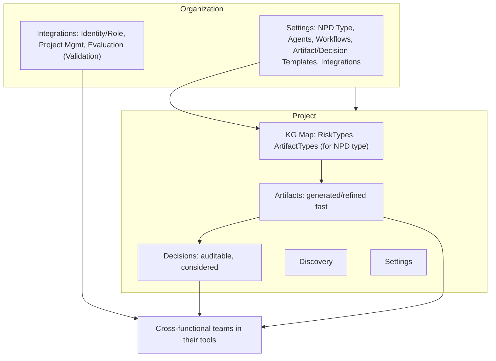

# Route & Entity Surface: Core vs Cleanup

---

## Summary for non-technical review (founder-friendly)

**What this is:** A one-page view of what the product *surface* is — the main places users go and the main things we configure. We’ve locked in a **small, stable core** and agreed how to grow from here without clutter.

**The product in one story:** **Artifacts** — generated and refined fast to enable better **Decisions** that are auditably more considered, so teams can approve and trace what changed. Underpinned by a **carefully constructed and refined KG Map** of **RiskTypes** and **ArtifactTypes** for the customer's type of **New Product Development** that shows how everything connects. All of this is brought to **cross-functional teams** via **Integrations** that meet them in their current tools (e.g. **Identity/Role** integrations, **Project Management** integrations to sync projects/issues in GitHub, Jira, etc., and **Evaluation** integrations to tune **Validation**), so they don’t have to leave where they already work. **Discovery** (explore and search) and **Settings** (user, org, project config — NPD Type, Agents, Workflows, Artifact Templates, Decision Templates, Integrations) round out the core.

**In plain terms:** Work happens inside an **Organization** (the customer) and one or more **Projects** (the NPD initiatives). For each project, the **KG Map** — built from the org's **NPD Type** (Digital, IOT, Manufacturing, etc.) — gives a shared picture of **RiskTypes** and **ArtifactTypes** and how they connect. **Artifacts** are created and updated quickly against that map; **Decisions** are where the team explicitly approves or rejects changes so that every step is auditable. **Discovery** supports research and exploration; **Settings** at **User**, **Organization**, and **Project** levels control who can do what, which workflows and templates apply, and how **Integrations** are configured. Those integrations — Identity/Role, Project Management (sync projects/issues), and Evaluation (Validation) — push and pull data between Reflexion and the tools teams already use, so the value of the map, artifacts, and decisions reaches **cross-functional teams** without forcing them to switch context.

**Surface at a glance (Organization and Project):**

**What we're simplifying (cleanup):**

- **Project configuration** — Not its own screen. “Project configuration complete for now” is approved from Decisions; any enrichment view lives with Map/Artifacts.
- **Concept Brief, Requirements, UX Brief** — Not separate screens. Those are approval types inside Decisions; users open and approve them from the Decisions list.
- **Project Management** — Not a top-level area. It becomes part of Integrations (e.g. under Settings → Integrations, or a “Backlog” view that uses the integration the org configured).

**How we grow from here:** We keep this core as the only main “places” in the product. New workflows, new agent-driven UI, and new capabilities are added through standard interfaces (agent–UI protocol and a single data layer), not by adding more top-level screens or menu items. That keeps the product understandable and consistent.

---

One table defining **core entities** (minimal, generic surface moving forward) and **cleanup candidates** (cruft to fold or remove).

**Design principle:** We have defined a **minimally viable core** (the routes and entities in the table below). Further surface — new views, new agent-driven UI, new capabilities — should be added **via AG-UI + GraphQL** rather than by adding more top-level routes or REST endpoints. The core stays small and stable; growth happens on the AG-UI channel (state, tool-based GenUI, human-in-the-loop) and the GraphQL schema (new types, queries, mutations).

---

## Single table: Core entities vs Cleanup candidates

| Category | Entity / Route | Current shape | Proposal | Rationale |
|----------|----------------|---------------|----------|-----------|
| **Core** | **Map** | `/map` (+ `?view=artifacts`) | Keep as single view for KG + artifact graph | One place for graph visualization and artifact topology. |
| **Core** | **Artifacts** | `/map?view=artifacts`, artifact viewer in pane | Treat as one capability: browse, view, edit, versions, **enrichment** | Generic “artifacts” surface; enrichment is an artifact action, not a separate route. |
| **Core** | **Decisions** | `/decisions` | Keep as single surface for all proposal types | List + approve/reject for link, enrichment, project configuration complete for now, and **all artifact proposals** (concept, UX, requirements, architecture, design). |
| **Core** | **Discovery** | `/discovery` | Keep if distinct user intent | Explore/search; no backend “discovery” endpoint but distinct workflow step. |
| **Core** | **Integrations** | `/backlog` (current) | **Two places:** (1) **Root `/integrations`** = product-level (ones we set; e.g. available types, Product_GitHub dogfood). (2) **Under Settings at each level** = user, org, and project configure their integrations (OAuth, **Project Management** — sync projects/issues) in **Settings → Integrations** for that scope. | Product-level integrations at root; per-user/org/project integration config lives under Settings at that scope. |
| **Core** | **Settings** | `/settings` | Keep. **Settings at multiple levels:** **User** (profile, preferences), **Org** (branding, **NPD Type**, **Agents**, **Workflows**, **Artifact Templates**, **Decision Templates**, admin, Integrations), **Project** (Integrations, etc.). **Integrations** is a section/tab under Settings at each level where applicable. | User: profile, preferences. Org: branding, NPD Type (Digital, IOT, Manufacturing; University pressure-tested), Agents, Workflows, Artifact Templates, Decision Templates, admin, Integrations. Project: Integrations. *Decision Templates not fully implemented yet.* |
| **Cleanup** | **Project configuration** (route) | `/hydration` | **Remove as route.** Fold into **Decisions** (approve “project configuration complete for now”) and optionally **Artifacts** (enrichment view). | “Project configuration” (formerly hydration) is a workflow phase. The capability is: (1) approve “complete for now” → Decisions; (2) view enrichment context → Artifacts or a sub-view, not a top-level route. |
| **Cleanup** | **Concept Brief** (route) | `/concept-brief` | **Remove as route.** Use **Decisions** + generic artifact options-approval (same UX, reached from decisions list). | Artifact-type-specific; should be “approve artifact proposal (options)” from `/decisions`, not a dedicated URL. |
| **Cleanup** | **Requirements** (route) | `/requirements` | **Remove as route.** Use **Decisions** + generic single-proposal approval. | Same as above: artifact-type-specific; one generic “artifact proposal” flow from Decisions. |
| **Cleanup** | **UX Brief** (route) | `/ux-brief` | **Remove as route.** Same as Concept Brief: options approval from Decisions. | Redundant with generic artifact approval; keep backend `artifact_type` and tool names, drop route. |
| **Cleanup** | **Project Management** (top-level) | `/backlog` | **Move under Integrations.** Redirect to `/integrations` or Project Management view (sync projects/issues). | **Project Management** (sync projects/issues) is an integration type; it should live under **Integrations**, not as a top-level route. |

---

## Summary

- **Core (6):** Map, Artifacts, Decisions, Discovery, **Integrations**, Settings.  
  **Settings** at **User**, **Org**, and **Project** levels. Under **Org Settings** (and product where applicable): **NPD Type** (Digital, IOT, Manufacturing; University pressure-tested), **Agents**, **Workflows**, **Artifact Templates**, **Decision Templates**, plus branding, admin, Integrations. (Decision Templates not fully implemented yet.) User: profile, preferences. Project: Integrations. **Integrations** in two places: (1) root `/integrations` = product-level. (2) Under Settings at each level = user/org/project configure OAuth and **Project Management** (sync projects/issues) in Settings → Integrations. Project Management *view* can be linked from Settings → Integrations or from nav.
- **Cleanup (5):** Project configuration (route), Concept Brief (route), Requirements (route), UX Brief (route), **Project Management (top-level)**.  
  Fold first four into Decisions + Artifacts. Migrate `/backlog` → Project Management (sync projects/issues) under Settings → Integrations for the current scope, or a dedicated view route that reads config from Settings.

---

## Implementation notes (for later)

- **Project configuration:** Auto-navigate to `/decisions` (not `/hydration`) when project configuration “complete for now” / `generate_project_configuration_summary` fires; enrichment “view” can live under Map/Artifacts or as a Decisions sub-state.
- **Concept / Requirements / UX Brief:** Decisions panel already shows these by `tool_name` / `artifact_type`. “View full proposal” can open the same options/single-proposal UI in a modal or slide-over from Decisions, with no dedicated `/concept-brief`, `/requirements`, `/ux-brief` routes. Deep links to a specific decision can use `/decisions?decisionId=...` (or scoped path when org/project in URL).
- **Backend:** No change to API names (e.g. `/hydration/apply` → project configuration apply, artifact_type values, tool names); only the **route surface** is simplified.
- **Settings:** Support **User**, **Org**, and **Project** levels (e.g. `/settings` with scope or nested routes). User: profile, preferences. Org: **NPD Type**, **Agents**, **Workflows**, **Artifact Templates**, **Decision Templates**, branding, admin, Integrations. Project: Integrations. **Integrations:** (1) Root `/integrations` for product-level. (2) Integrations under Settings at each level: OAuth and **Project Management** (sync projects/issues) config. Project Management *view* lives under Settings → Integrations or as a nav destination. Redirect `/backlog` to that view or to Settings → Integrations.

---

## Settings at multiple levels (User, Org, Project)

- **User-level Settings:** Profile, preferences (e.g. theme, notifications, default org). Shown when the user is in “my account” / “my settings” context. Route could be `/settings` (user-scoped when no org in context) or `/settings/profile`, etc.
- **Org-level Settings:** **NPD Type** — the kind of NPD the org does; currently **Digital**, **IOT**, **Manufacturing**, with **University** pressure-tested. Drives which domain knowledge / model applies (distinct from **Domain** entity in the KG). **Agents** (agent config, overrides), **Workflows** (workflow definitions, which workflow this org uses), **Artifact Templates** (templates for concept brief, requirements, UX brief, etc.), **Decision Templates** (templates or types for decisions — not fully implemented yet), branding, admin, **Integrations** (OAuth, Project Management — sync projects/issues). What we today think of as “System Settings” for the org.
- **Project-level Settings:** **Integrations** and project-specific config for that project (if applicable). NPD Type, Agents, Workflows, Artifact Templates, Decision Templates may be inherited from org or overridable per project depending on product design.
- **Integrations** under Settings applies at each level where it makes sense: user (e.g. connected accounts), org (OAuth clients, Project Management — sync projects/issues), project (which integration this project uses).

**Core under Settings (Org):** **NPD Type** | **Agents** | **Workflows** | **Artifact Templates** | **Decision Templates** | Branding | Admin | Integrations. (**NPD Type** = Digital, IOT, Manufacturing; University pressure-tested. Drives domain knowledge for the org; distinct from **Domain** in the KG.) (User and Project have the subsets listed above. Decision Templates not fully implemented yet.)

---

## Integrations: root (product) vs under Settings (each level)

- **Root `/integrations` (product level):** Integrations *we* set at the product level — available integration types, product defaults, dogfood setup (e.g. **Product_GitHub**). Read-oriented or admin: “what integrations exist” and how the product is wired.
- **Integrations under Settings at each level:** At **user**, **org**, and **project** (where applicable), **Integrations** is a section or tab under **Settings**. That’s where the user or org configures integrations for that scope: OAuth clients (Google, GitHub, Jira, …), **Project Management** (sync projects/issues), connected accounts (user), etc. So: **Settings → Integrations** = per-user/org/project integration config.
- **Project Management:** Integration for syncing projects and issues (e.g. synchronizeProjects/Issues) is configured in **Settings → Integrations** for that org (or project). The Project Management *view* (sync projects, sync issues, e.g. “Sync with GitHub”) can live as a sub-view under Settings → Integrations or as a separate nav destination that uses the integration configured for the current scope.
- **Dogfooding:** We use Product_GitHub at product level; our org’s Settings → Integrations points at that and shows the Project Management view (sync projects, sync issues).

---

## GCP analogy: Integrations → OAuth (the “missing API”)

**Conceptually:** Same idea as **GCP → Integrations (or APIs & Services) → OAuth / Credentials**.

- In GCP you have a **project** (tenant). Under it you have **APIs & Services** (or **Integrations**), and under that **Credentials** → **OAuth 2.0 Client IDs** (and other credential types). That’s where you register and manage OAuth clients per provider.
- In Reflexion the equivalent is: **Org** (tenant) → **Integrations** (surface) → **OAuth** (config layer). The “missing API” for **Google OAuth clients** (and other providers) fits here: per-org configuration of which OAuth apps are allowed and how they’re used.

So the analogy is:

| GCP | Reflexion |
|-----|-----------|
| Project | Org (customer) |
| APIs & Services / Integrations | **Integrations** (route + capability) |
| Credentials / OAuth 2.0 Client IDs | **OAuth** — manage OAuth clients per provider (Google, GitHub, Jira, …) for this org |
| (Consumers of credentials) | **Project Management** (sync projects/issues), future integrations — they *use* OAuth under the hood |

**Implication:** Structure Integrations “correctly” by making **OAuth** a first-class sub-surface under Integrations (where we register and manage OAuth clients per org/user), and **Project Management** (sync projects/issues) and other integration types the *consumers* of that config. Because **Integrations** lives under **Settings** at each level, OAuth and Project Management config are **Settings → Integrations** (user/org/project); product-level integration definitions live at **root `/integrations`**.

---

## Suggested structure: Integrations (route + API)

**Route (UI):**

- **Root (product level):**
  - **`/integrations`** — product-level integrations: what we set (available types, Product_GitHub dogfood, etc.). Read or admin.
- **Per-level (under Settings):**
  - **User Settings** — e.g. **`/settings`** (user scope) or **`/settings/profile`**: profile, preferences; optionally **Settings → Integrations** for connected accounts (user-level OAuth).
  - **Org Settings** — e.g. **`/settings`** with org in scope; sections/tabs: **NPD Type** (Digital, IOT, Manufacturing; University pressure-tested), **Agents**, **Workflows**, **Artifact Templates**, **Decision Templates**, branding, admin, **Integrations** (OAuth clients, Project Management — sync projects/issues). This is where the “missing” Google OAuth client API is used and exposed for the org.
  - **Project Settings** — Integrations and project-specific overrides when applicable (NPD Type, Agents, Workflows, Artifact Templates, Decision Templates may be org-level with optional project override).
  - **Project Management view** (sync projects, sync issues) — sub-view under Settings → Integrations or a separate nav target that uses the integration configured for the current org in Settings. Redirect `/backlog` to that view or to Settings → Integrations.

**API (backend):**

- **Product level:** Optional **`GET /integrations`** (or admin) — list integration types / product-level config.
- **Org level (under auth/orgs):** **`GET /auth/organizations/{org_id}/integrations`** — list integration status for this org. **`GET|POST|PUT|DELETE /auth/organizations/{org_id}/integrations/oauth`** (or **`/integrations/oauth-clients`**) — the missing API: OAuth client configs per org (Google, GitHub, Jira, etc.).
- Project Management APIs (e.g. synchronize projects/issues) stay scoped by org and *use* the OAuth config for that org (stored via Settings → Integrations).

So: **Integrations at root** = product level (we set); **Integrations under Settings at each level** = where user, org, and project configure OAuth and Project Management (sync projects/issues) (where applicable). **Settings** exists at **User**, **Org**, and **Project** levels. GCP-style OAuth client management lives under Settings → Integrations for that scope.

---

## Pressure test: AG-UI and GraphQL

How the route/entity surface holds up if we adopt **[AG-UI](https://www.copilotkit.ai/ag-ui)** (Agent–User Interaction) and/or add a **GraphQL** interface.

### AG-UI (Agent–User Interaction)

**What it is:** [AG-UI](https://www.copilotkit.ai/ag-ui) is an open protocol for the **bi-directional connection** between a user-facing app and an agentic backend. It sits at the agent↔UI boundary (distinct from MCP = context, A2A = agent coordination). It enables: **Shared State**, **Tool-Based GenUI**, **Subgraphs**, **Agentic Chat**, **Human in the Loop**, **Agentic GenUI**, **Predictive Updates**. CopilotKit provides React/Angular AG-UI clients and a hosted AG-UI platform (guardrails, analytics, learning).

**Impact on our design:**

| Aspect | Holds? | Notes |
|--------|--------|-------|
| **Route surface (Map, Decisions, Artifacts, Settings, Integrations)** | ✅ Yes | Routes define *which view* the user is on. AG-UI defines *how* the agent and that view stay in sync (state, tool calls, human-in-the-loop). Same canonical views; different *wire protocol* for the agent↔UI channel. |
| **Decisions as “human in the loop”** | ✅ Strong fit | Decisions *are* human-in-the-loop (approve/reject). AG-UI’s Human in the Loop and Tool-Based GenUI map directly to our decision cards and proposal UIs. We could expose the same flow over AG-UI so any AG-UI client can render approvals. |
| **Streaming / agent chat** | ✅ Fits | Today we stream from LangGraph and render in the thread. AG-UI would standardize that channel (agentic chat, shared state). Our route stays “user is on Map or Decisions”; the *connection* to the agent could be AG-UI. |
| **State sync (e.g. KG, workflow phase)** | ✅ Fits | Map view and workflow strip depend on backend state. AG-UI’s “Shared State” is exactly that: bi-directional sync of agent and application state. Route = view context; AG-UI = how state for that view is updated. |
| **Settings / Integrations (CRUD)** | ⚠️ Either way | Settings and Integrations are mostly CRUD + OAuth. AG-UI could carry mutations (e.g. “update OAuth client”) as tool calls or state updates, or we keep those as REST/GraphQL. Recommendation: **routes unchanged**; agent-driven changes to settings can go over AG-UI; direct user CRUD can stay REST or GraphQL. |

**Summary (AG-UI):** Our **route surface and entity list stay as-is**. AG-UI becomes the **protocol at the agent↔UI boundary** for chat, state sync, tool-based GenUI, and human-in-the-loop. We might add an **AG-UI endpoint** (or use CopilotKit’s hosted layer) alongside existing REST; routes still identify the view, and AG-UI identifies *how* the agent and that view interact. No need to rename or merge routes for AG-UI.

---

### GraphQL interface

**What it is:** A single endpoint (e.g. `POST /graphql`) with a schema; clients request exactly the shape they need (queries and mutations). Good for view-specific payloads and reducing over-fetch/under-fetch.

**Impact on our design:**

| Aspect | Holds? | Notes |
|--------|--------|-------|
| **Route surface** | ✅ Yes | Routes remain view routes. GraphQL is a *data* interface. Each route can be backed by one or more GraphQL operations (e.g. `MapView` query for `/map`, `DecisionsPanel` query for `/decisions`, `Organization.integrations` for Settings → Integrations). |
| **Entity alignment** | ✅ Improves | Our core entities (Map/KG, Artifacts, Decisions, Discovery, Integrations, Settings) map cleanly to **GraphQL types**: `KnowledgeGraph`, `Artifact`, `Decision`, `Organization`, `Integration`, `OAuthClient`, `UserSettings`, etc. Scopes (user, org, project) map to **context** (e.g. `Organization(id)`, `Project(id)`). |
| **API consolidation** | ✅ Benefit | Today we have many REST endpoints. GraphQL could expose one schema: `Query { map(projectId, version), decisions(projectId), organization(id) { integrations, oauthClients }, ... }`, `Mutation { applyDecision, updateOAuthClient, ... }`. The “missing API” (OAuth clients per org) becomes e.g. `Organization.integrations.oauthClients`. |
| **E2E / contract** | ✅ Clear | Each **route** can document its **required GraphQL operations** (query + mutations). E2E tests: “for `/decisions`, run `DecisionsPanel` query and `applyDecision` mutation.” Same idea as REST route → API mapping, with a single entry point. |
| **Settings at multiple levels** | ✅ Natural | User/Org/Project Settings map to `User.settings`, `Organization.settings`, `Project.settings`, or a unified `Settings(scope: USER | ORG | PROJECT, scopeId: ID)`. Integrations under Settings = `Organization.integrations`, `User.connectedAccounts`, etc. |

**Summary (GraphQL):** Our **entity and route design is GraphQL-friendly**. Add a **GraphQL schema** that mirrors our entities and scopes; keep **routes as the canonical view list**; document which GraphQL operations each route uses. REST can remain for simplicity or backward compatibility; GraphQL can be the primary data interface for the app. No change to the *list* of core entities or cleanup candidates; we just add a second *interface* (GraphQL) to the same capabilities.

---

### AG-UI + GraphQL together

- **AG-UI:** Agent↔UI channel (streaming, state sync, human-in-the-loop, tool-based GenUI). Used for: chat, decisions flow, workflow phase, map state updates.
- **GraphQL:** Data interface for CRUD and view data (Map, Artifacts, Decisions list, Settings, Integrations). Used for: loading view payloads, mutations that are not agent-mediated (e.g. user edits OAuth client in Settings).

So: **routes** = canonical views (unchanged). **AG-UI** = how the agent talks to those views. **GraphQL** = how the app loads and mutates data for those views (and for Settings/Integrations). Both can coexist with current REST; adoption can be incremental (e.g. GraphQL for Settings/Integrations first, AG-UI for the agent thread and decisions).

**Principle:** The **core** (minimally viable route/entity set) is fixed. **More surface** from here — new workflows, new agent-driven UI, new data needs — should be delivered **via AG-UI + GraphQL**, not by expanding the core route list or REST surface.
