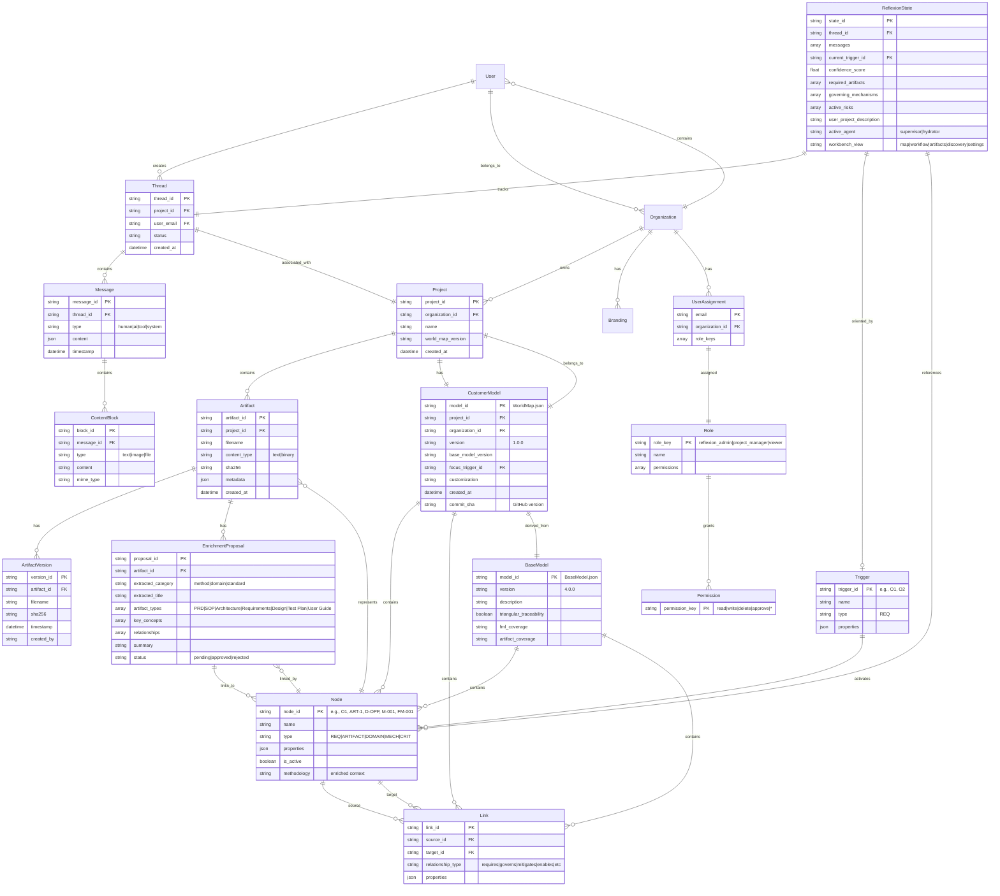
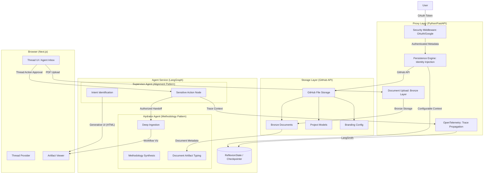
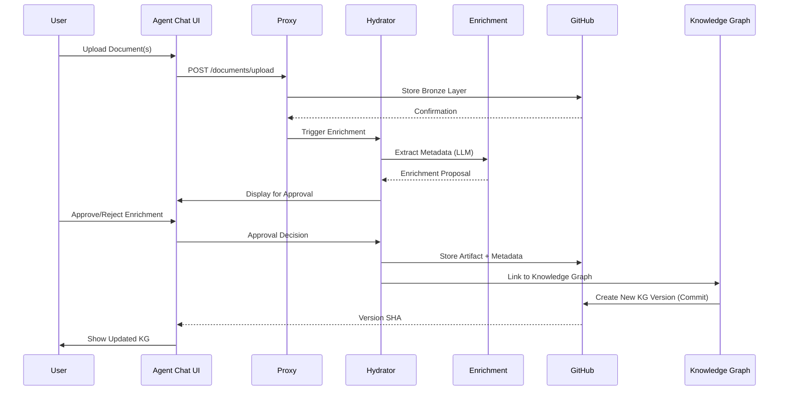

# Reflexion Architecture Documentation

This document provides comprehensive architecture views of the Reflexion system, complementing the C4 architecture with entity-level and data model perspectives.

## Table of Contents

1. [Entity Relationship Diagram](#entity-relationship-diagram)
2. [C4 Architecture Summary](#c4-architecture-summary)
3. [Data Flow Architecture](#data-flow-architecture)
4. [Storage Architecture](#storage-architecture)

---

## Entity Relationship Diagram

The following diagram shows the key entities and their relationships across agent-chat-ui, Reflexion, and the World/Customer Model systems.



### Key Entity Groups

#### Agent-Chat-UI Entities
- **User**: Authenticated users linked to Organizations
- **Thread**: Conversation sessions associated with Projects
- **Message**: Individual messages with multimodal ContentBlocks
- **Project**: Work containers with associated CustomerModel
- **Artifact**: Uploaded documents with versioning and enrichment

#### Reflexion Entities
- **ReflexionState**: Workflow state tracking orientation, artifacts, mechanisms, risks
- **Trigger**: Orientation points (e.g., O1 = Market-pull innovation)

#### World/Customer Model Entities
- **BaseModel**: The "Universe" model (BaseModel.json v4.0.0)
- **CustomerModel**: Project-specific filtered views via "Universe Tagging"
- **Node**: Knowledge graph entities (REQ, ARTIFACT, DOMAIN, MECH, CRIT)
- **Link**: Relationships maintaining graph structure and traceability

#### RBAC Entities
- **Organization**: Multi-tenant isolation boundary
- **UserAssignment**: Maps users to organizations and roles
- **Role**: Permission sets (reflexion_admin, project_manager, viewer)
- **Permission**: Granular access control

---

## C4 Architecture Summary

### System Context

The Reflexion platform manages the transition from ambiguous project ideas to structured product development plans through identity-aware agents.

**External Dependencies:**
- Google OAuth (Identity)
- Anthropic API (Reasoning Engine)
- GitHub API (File Storage & Issues)
- LangSmith (Observability)
- PostgreSQL (Checkpointer/State Persistence)
- Redis (Background Tasks)

### Container & Component Diagram



### Key Components

#### Supervisor Agent (Strategic Intent Alignment)
- **Mission**: Map project descriptions to valid methodology triggers
- **Movements**: 
  - Soft Proposal: Non-interrupting Knowledge Graph render
  - Authorized State Transition: `classify_intent` via `sensitive_tool_node` with mandatory `interrupt()`

#### Hydrator Agent (Deep Methodology Ingestion)
- **Mission**: Bridge "Orientation" to iterative "Concept → Design → Operations" loop
- **Movements**:
  - Workflow Visualization: Updates `active_node` showing progression
  - Persistence Sync: Uses `save_external_context` for customer-specific knowledge
  - Document Artifact Typing: Links uploaded documents to artifact types (PRD, SOP, Architecture, etc.)

#### Proxy (Identity Guardrail)
- **Mission**: Enforce multi-tenancy and security
- **Movements**:
  - Identity Extraction: Injects `user_id` and `customer_id` from Google OAuth
  - Path Enforcement: Ensures customer-specific directory structure
  - Document Upload: `/documents/upload` endpoint for bronze layer persistence
  - Trace Propagation: OpenTelemetry context propagation

#### GitHub File Storage (Direct API Persistence)
- **Mission**: Unified persistence via GitHub Contents API
- **Scope**: Branding configs, project models, bronze document storage
- **Bronze Layer**: Immutable raw documents at `data/organizations/{customer_id}/projects/{thread_id}/documents/bronze/{document_id}/`

---

## Data Flow Architecture

### Artifact Ingestion Flow



### Workflow Lifecycle

1. **Orientation (Supervisor)**: Analyze project scope, identify methodology triggers
2. **Approval (HITL)**: User reviews proposed model via Agent Inbox
3. **Hydration (Hydrator)**: Inject methodology, gather customer context
   - Accept document uploads (bronze layer)
   - Link documents to artifact types
4. **Concept**: Define high-level concepts and requirements
5. **Design**: Create detailed design specifications
6. **Operations**: Implement and operationalize
7. **Loop**: Return to Concept for iterative refinement

---

## Storage Architecture

### GitHub Repository Structure

```
data/
├── organizations.json                    # Global organization list
├── organizations/
│   ├── {org_id}/
│   │   ├── users.json                    # User assignments
│   │   ├── branding.json                 # Organization branding
│   │   └── projects/
│   │       ├── {project_id}/
│   │       │   ├── WorldMap.json         # Customer Model (versioned via commits)
│   │       │   └── artifacts/
│   │       │       └── {artifact_id}/
│   │       │           ├── content.{ext} # Current artifact content
│   │       │           ├── metadata.json  # Artifact metadata + versions
│   │       │           └── versions/     # Version snapshots
│   │       │               └── v{timestamp}_{hash}.{ext}
│   │       └── documents/
│   │           └── bronze/               # Immutable raw documents
│   │               └── {document_id}/
│   │                   └── {filename}
```

### Versioning Strategy

- **CustomerModel (WorldMap)**: GitHub commit SHA-based versioning
  - Each KG update creates a new commit
  - Commit messages provide meaningful version descriptions
  - Timeline view shows all versions with full metadata

- **Artifact**: Timestamp-based version IDs
  - Format: `v{YYYYMMDD}_{HHMMSS}_{hash}`
  - Versions stored in `versions/` subdirectory
  - Metadata tracks version history in `metadata.json`

- **BaseModel**: Semantic versioning (currently 4.0.0)
  - Full structural model with all nodes and links
  - Customer models derived via "Universe Tagging"

### Multi-Tenant Isolation

- **Organization-level**: All data scoped to `{org_id}`
- **Project-level**: Projects isolated within organizations
- **User-level**: RBAC controls access via roles and permissions
- **Path Enforcement**: Proxy ensures all operations respect tenant boundaries

---

## Key Relationships

1. **User → Thread → Message**: Conversation flow
2. **Organization → Project → CustomerModel**: Multi-tenant isolation
3. **BaseModel → CustomerModel**: Universe tagging creates customer-specific views
4. **Trigger → Node**: Orientation activates relevant nodes
5. **Artifact → EnrichmentProposal → Node**: Artifacts linked to KG via enrichment
6. **CustomerModel → Node → Link**: Graph structure
7. **Artifact → ArtifactVersion**: Version history tracking

---

## Observability Architecture

### OpenTelemetry Integration

- **Client-Side**: OpenTelemetry Web SDK in Next.js
  - Captures thread operations and HTTP requests
  - Includes LangSmith attributes (`langsmith.trace.name`, `langsmith.span.kind`)
  
- **Trace Propagation**: `traceparent`/`tracestate` headers
  - Propagated from frontend through proxy to LangGraph
  - Unified trace correlation across all layers

- **Backend Integration**: LangGraph metadata enriched with OTEL trace/span IDs
  - All traces unified in LangSmith
  - End-to-end distributed tracing for diagnostics

---

*This architecture documentation is maintained alongside the codebase and reflects the current system design as of the latest release.*
